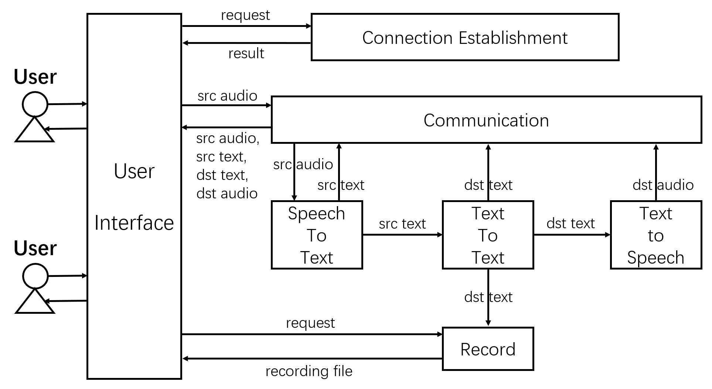

# Live-multi-lingual-communication
This program is going to use WebRTC and google cloud APIs to build a peer to peer (audio and video) call application. And provide functions like speech-to-text conversion, text/audio translation and text recording to make it more convenient for cross-language communication.

### User Story
* I, a worker who wfh, would like to mute the audio but still know the content of an online meeting when I receive a phone call.
* I, an owner of a foreign commerce startup company, would like to use this app to communicate with my foreign traders.
* I, having reading disability, would like to hear the translation rather than reading it.
* I, a secretary, would like to record the text of a meeting automatically.

## MVPs
* This app should be able to convert the speech of the online call into text in real time.
* This app should be able to translate the text in another language specified by the user.
* This app should be able to convert the translated text into audio in almost real time.
* This app should be able to record the translated text into a file for user to download.

### Structure

### License
noracnr@bu.edu
yqz2019@bu.edu
